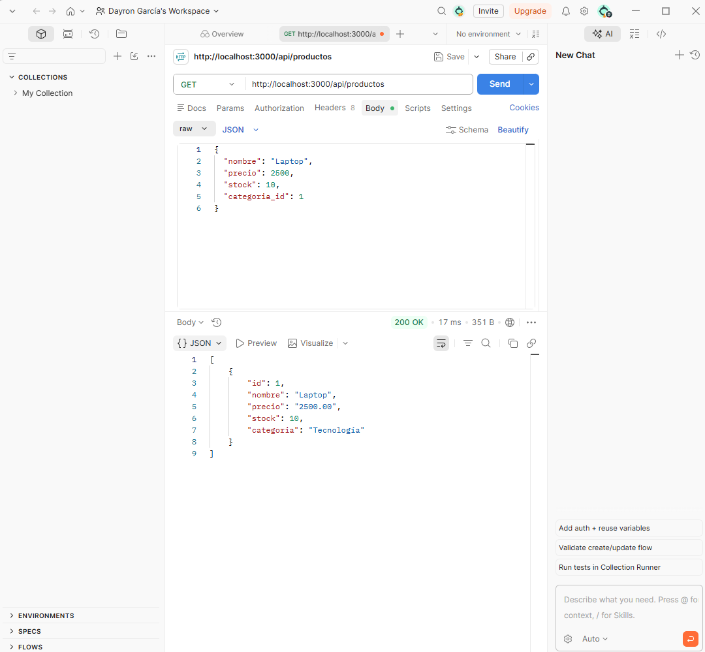
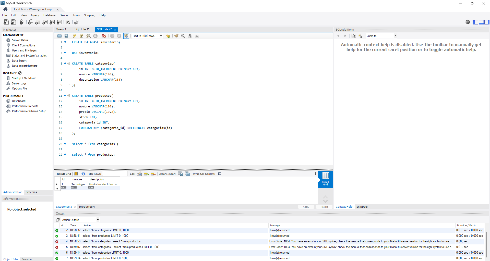
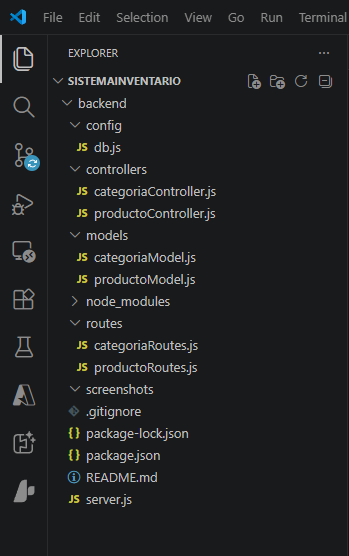

# Sistema de Gestión de Inventario

API REST desarrollada con Node.js, Express y MySQL para gestionar categorías y productos.

## Tecnologías utilizadas

- Node.js
- Express
- MySQL
- MySQL Workbench
- Postman

## Funcionalidades

- CRUD de categorías
- CRUD de productos
- Relación entre categorías y productos
- API REST

## Instalación

```bash
npm install
```

```bash
node server.js
```

o

```bash
npx nodemon server.js
```

## Endpoints

### Categorías

- GET /api/categorias
- POST /api/categorias
- PUT /api/categorias/:id
- DELETE /api/categorias/:id

### Productos

- GET /api/productos
- POST /api/productos
- PUT /api/productos/:id
- DELETE /api/productos/:id

## Capturas

### API funcionando en Postman



### Base de datos MySQL



### Estructura del proyecto

git add .
git commit -m "Agregar capturas al README"
git push


## Autor


Dayron García